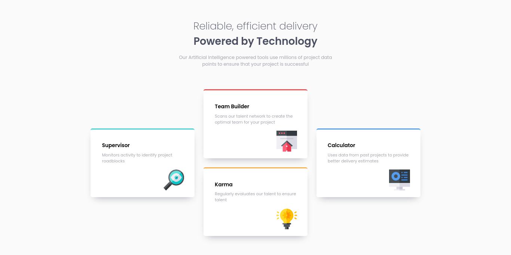

# Frontend Mentor - Four card feature section

## Table of contents

- [Overview](#overview)
  - [Screenshot](#screenshot)
  - [Links](#links)
- [Author](#author)

## Overview

### Screenshot

### Links

- Solution URL: [GitHub](https://github.com/gabcchaves/four-card-feature-section)
- Live Site URL: [Live](https://gabcchaves.github.io/four-card-feature-section)

### Built with

- HTML5
- CSS3

## Author

- [Website](https://gabcchaves.github.io)
- [FrontendMentor](https://www.frontendmentor.io/profile/gabcchaves)
